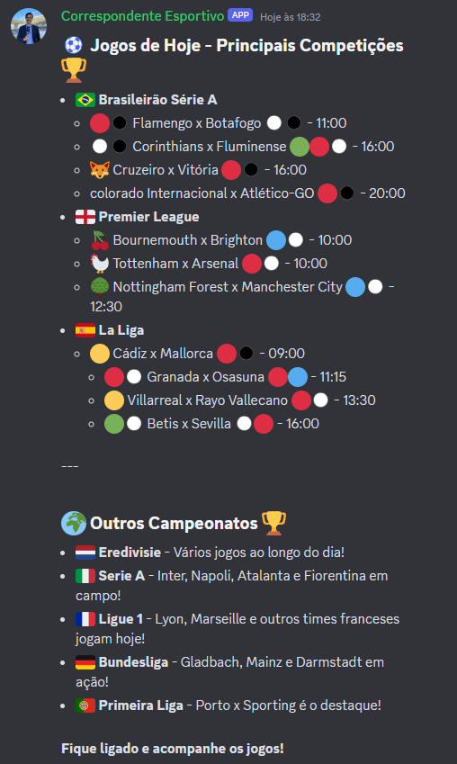

# Seja bem-vindo ao Correspondente Esportivo!

Este projeto utiliza Node.js e TypeScript para buscar informações de jogos de futebol em tempo real e apresentá-las de forma formatada e amigável aos usuários de canais no Discord.

### Funcionalidades:

* Exibe os jogos do Dia;
* Separa em Principais competições & Outros Campeonatos;
* Mostra os Horários dos jogos;
* Mostra os Possiveis canais de Streaming dos jogos;
* Mostra as Possiveis transmissões em canais não-oficiais;

### APIs utilizadas:

* **[Football Api:](https://www.football-data.org/documentation/quickstart)** Obter detalhes dos jogos;
* **[Geminiai:](https://geminiai.ai/)** Formatar o texto para o prompt.

**Contribuições:**

Sinta-se à vontade para contribuir com o projeto! Envie suas sugestões, correções de bugs ou novas funcionalidades através de pull requests.
